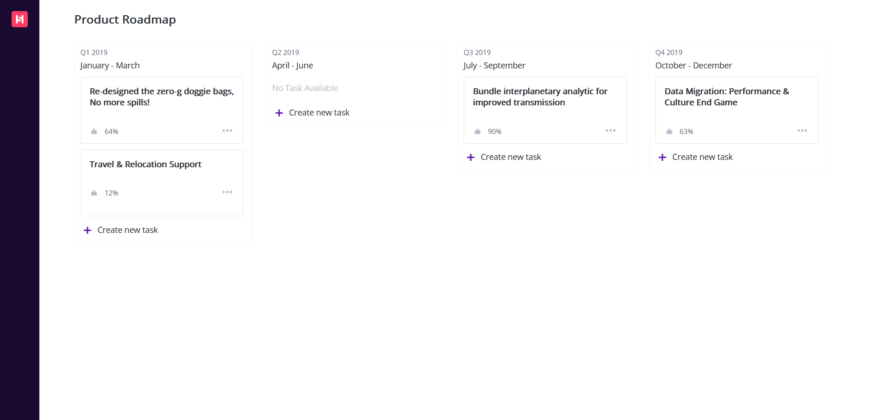

# React + Vite

# Design Mockup by
# PT. Indonesia Untuk Dunia (https://www.happy5.co/).

# live Preview 
- [live preview](https://azanra.github.io/intern-col-h5/)

# About
This project focus on converting mockup design to static
website using react and vite. The project focus on creating
a component that reusable throughout the project, and try
to decrease redundant code.

# Review
- Organize the component, or at the very least make it so
that it easier to understand on the first glances.
- Write a clearer commit messages, explain why this commit
happen instead of change that happen.
- Store the css positioning in var, so that it can be reused
for other component, ensuring consistency on positioning.

# Screenshot

